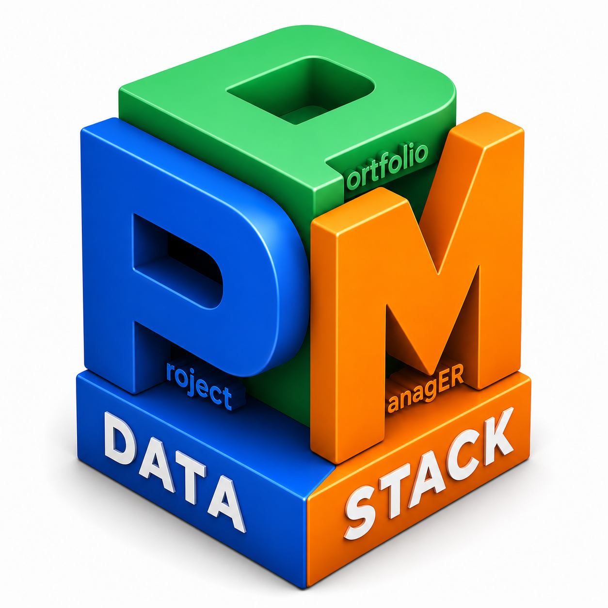
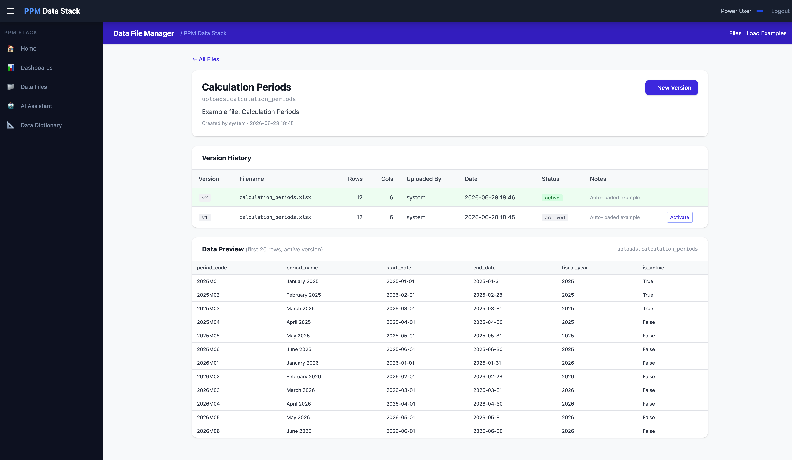
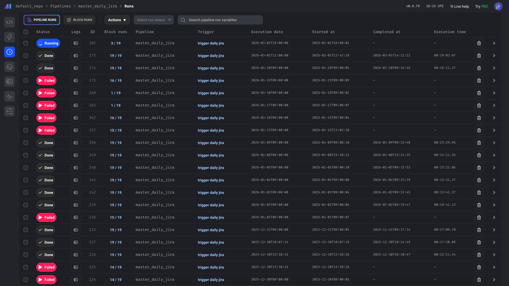
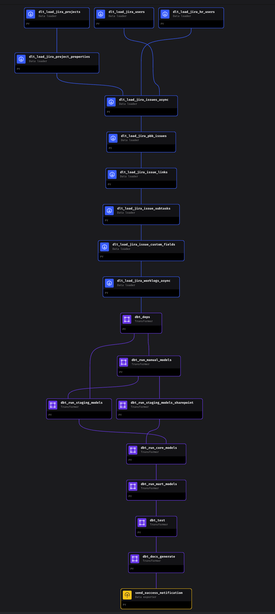
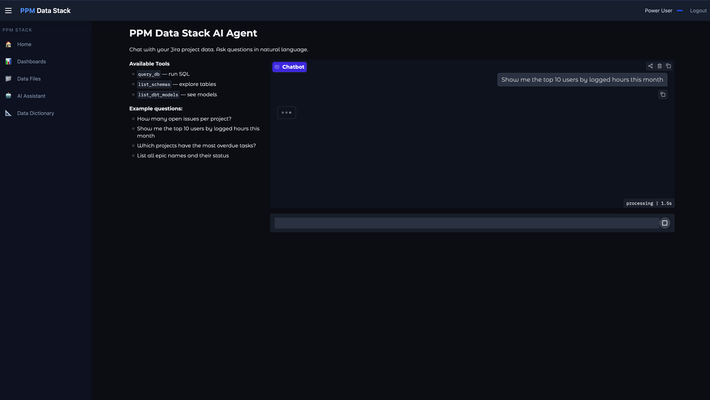

# ppmER — Project & Portfolio Management Data Stack

<p align="center">
  
</p>

> **Open-source Project & Portfolio Management (PPM) intelligence platform** built on Jira data.
>
> Self-hosted · Free · Extensible · Production-ready in minutes.

[](https://www.docker.com/)
[](https://www.getdbt.com/)
[](https://www.postgresql.org/)
[](https://www.metabase.com/)
[](LICENSE)

---

## What is ppmER and why you need it?

Enterprise PPM tools (Planview, Clarity, ServiceNow PPM) cost tens of thousands per year and lock your data behind proprietary schemas. 

Jira Advanced Roadmaps gives you boards, not a data warehouse.

Project and Portfolio Teams spend days dealing with numerous data quality problems, such as data cleaning, different distribution algorithms, and matching rules, among dozens of different, complex Excel files, in order to collect data from different fields, applications, and suppliers in different schemas and make it possible for them to communicate and match with each other.

**ppmER data stack** offers many of the analytical features provided by enterprise PPM tools under one roof, in a much simpler, more user-focused, end-to-end way, as open-source.

**ppmER** gives you:

- A **full analytical PPM data warehouse model** on top of your existing Jira data
- **SQL access** to every project, issue, worklog, and sprint — forever with historicaly and snapshots
- **Extensible pipelines** to mix in Jira, SharePoint lists *(optional)*, Excel uploads, HR data etc.
- **Native Excel/CSV ingestion** — upload your own spreadsheets and cross-analyze with warehouse data via the Upload UI or Metabase's built-in Excel upload feature
- A **unified portal** for every role in your organization — analyst, developer, manager
- **Agentic AI platform & AI Assistants** powered by [**DB-GPT**](https://github.com/eosphoros-ai/DB-GPT) for natural-language queries and autonomous data exploration
- **End-to-end Metadata & Data Governance** — full data lineage via **dbt docs**, with [**OpenMetadata**](https://open-metadata.org) integration planned for catalog and governance workflows

No price. No licenses. No vendor lock-in. ***Your data, your infrastructure.***

---

## Screenshots

| Orchestration Pipelines (Mage)      | Data Dictionary & Lineage (dbt) |
| ----------------------------------- | ------------------------------- |
|  |  |

| Data Ingestion (dlt + mage)                     | Data Warehouse (PostgreSQL)             |
| ----------------------------------------------- | --------------------------------------- |
|  |  |

| Dashboards (Metabase)                             | Data Upload & Versioning                       |
| ------------------------------------------------- | ---------------------------------------------- |
|  |  |

| Monitoring                                        | Portal (Single Point of View)            |
| ------------------------------------------------- | ---------------------------------------- |
|  |  |

| Agentic AI & Chatbot                | ...                                     |
| ----------------------------------- | --------------------------------------- |
|  |  |

---

---

## Architecture

```
┌─────────────────────────────────────────────────────────────────┐
│                    **  Data Sources **                          │
│   Jira Cloud API  ·  SharePoint Lists  ·  Excel / CSV Upload    │
└──────────┬──────────────────┬───────────────────┬───────────────┘
           │ dlt (Python)     │ dlt               │ Upload API/UI
           ▼                  ▼                   ▼
┌─────────────────────────────────────────────────────────────────┐
│                 ** PostgreSQL Data Warehouse **                 │
│                                                                 │
│     raw_jira  ·  raw_sharepoint  ·  raw_manual  ·   uploads     │
│                             │                                   │
│                             │ dbt (SQL transformations)         │
│            ┌─>>>>>>>>>>>>>>─┼─>>>>>>>>>>>>>>──┐                 │
│            ▼                ▼                 ▼                 │
│         staging            core              mart               │
│      (clean views)    (dim + fact)    (business KPIs)           │
│                             │                                   │
└─────────────────────────────┬───────────────────────────────────┘
             ┌────────────────┼─────────────────┐
             ▼                ▼                 ▼
         Metabase         OpenMetadata       AI Agent
    (BI & Dashboards)   (Data Governance)  (Chat w Data)
                              │
                              │ Embed / RBAC
                              ▼
                           Portal
                        (Unified UI)
      
```

**Orchestration:** Mage AI schedules every pipeline and dbt run, development & monitoring UI.

---

## Services at a Glance

| Service               | Port  | Purpose                                            |
| --------------------- | ----- | -------------------------------------------------- |
| **Portal**      | 9000  | Role-based unified UI — entry point for all users |
| **Metabase**    | 3000  | Dashboards & self-service analytics                |
| **Mage AI**     | 6789  | Pipeline orchestration & scheduling                |
| **dbt Docs**    | 8081  | Data dictionary & lineage explorer                 |
| **CloudBeaver** | 8978  | SQL browser for power users                        |
| **Upload API**  | 8085  | Excel / CSV ingestion with version history         |
| **AI Agent**    | 7860  | Natural-language queries over PPM data             |
| **PostgreSQL**  | 15432 | Central data warehouse                             |

---

## Quick Start

```bash
# 1. Clone
git clone https://github.com/fxerkan/ppmER.git
cd ppmER

# 2. Configure
cp .env.example .env
# Edit .env — fill in your Jira subdomain, email, and API token

# 3. Start everything
docker compose up -d

# 4. Load data
docker exec ppm-dlt python /app/jira/jira_projects.py
docker exec ppm-dlt python /app/jira/jira_issues.py
docker exec ppm-dlt python /app/jira/jira_worklogs_optimized.py

# 5. Transform
dbt run --project-dir dbt --profiles-dir dbt --target local

# Open the portal
open http://localhost:9000
```

**Demo accounts** (change passwords in `.env`):

| Username      | Password        | Role                                          |
| ------------- | --------------- | --------------------------------------------- |
| `admin`     | `Jppm@min123` | Full access — all tools                      |
| `developer` | `Jppm@min123` | Developer tools (Mage, CloudBeaver, dbt Docs) |
| `analyst`   | `Jppm@min123` | Power user (Metabase, Data Files, AI Agent)   |
| `user`      | `Jppm@min123` | View only (Metabase dashboards)               |

---

## PPM Features

### Currently Available

**Portfolio Overview**

- Total project count by status, type, and team
- Open issue count with priority breakdown
- Worklog hours by project and period
- Portfolio health scores

**Time & Effort Tracking**

- Worklog fact table with historical snapshots (`fact_worklogs`)
- Distributed effort calculations across periods (`fact_distributed_efforts_*`)
- CAPEX/OPEX classification per worklog (`fact_capex_opex_adjustment`)
- Missing effort reports (`rpt_missing_effort`)

**Project Dimensions**

- Project master data with categories, leads, and custom fields (`dim_projects`)
- User directory synced from Jira (`dim_users`)
- HR user enrichment via manual upload (`dim_hr`)
- Issue hierarchy: Epics → Stories → Sub-tasks (`map_issue_subtasks`)

**Data Ingestion**

- Incremental Jira sync (issues, projects, users, worklogs, subtasks, issue links)
- SharePoint list ingestion (risks, budgets, calculation periods)
- Excel/CSV upload with version history and instant DB materialization
- Mage AI orchestration with scheduling and retry logic

**Developer Experience**

- dbt data lineage graph with full documentation
- CloudBeaver SQL browser with pre-configured connection
- AI agent for natural-language data exploration

---

## Roadmap — What Can Be Added

The warehouse schema is designed to be extended. Each item below maps to a new dlt source or dbt model:

### 🔵 Near-term (data already available in Jira)

| Feature                                 | How to build                                                            |
| --------------------------------------- | ----------------------------------------------------------------------- |
| **Sprint velocity & burndown**    | Add`jira_sprints.py` dlt source → `fact_sprint_velocity` dbt model |
| **Cycle time & lead time**        | Extend`fact_issues` with status transition timestamps                 |
| **Team capacity vs. utilization** | Join`dim_hr` (contracted hours) with `fact_worklogs`                |
| **Cross-project dependency map**  | `jira_issue_links_optimized.py` already loads → add Metabase graph   |
| **SLA / due-date compliance**     | Add`due_date` field to `fact_issues`, compute breach %              |
| **Issue aging report**            | Days-open calculated field in`stg_jira__issues`                       |

### 🟡 Medium-term (needs new data source)

| Feature                               | How to build                                                       |
| ------------------------------------- | ------------------------------------------------------------------ |
| **Budget vs. actuals**          | Add budget Excel upload → join with`fact_distributed_efforts_*` |
| **Resource demand forecasting** | Upload planned allocations → compare with logged hours            |
| **Risk register dashboard**     | SharePoint risk list already ingested → build Metabase dashboard  |
| **OKR / Goal tracking**         | New upload template →`fact_okr_progress` dbt model              |
| **Program Increment planning**  | Add PI board data via Jira Align API or Excel upload               |
| **Portfolio financial summary** | CAPEX/OPEX by business unit, quarter, and project type             |

### 🟢 Long-term (ML / AI layer)

| Feature                                 | How to build                                        |
| --------------------------------------- | --------------------------------------------------- |
| **Predictive delivery date**      | Train on historical velocity → serve via AI agent  |
| **Anomaly detection on worklogs** | Flag unusually high/low effort weeks automatically  |
| **Natural-language KPI queries**  | AI agent already connected — expand prompt library |
| **Executive PDF reports**         | Scheduled Metabase export → email via SMTP         |
| **Slack / Teams notifications**   | Add webhook step to Mage pipelines                  |

---

## Comparison with Enterprise PPM Tools

| Capability          |              **ppmER**              | Planview / Clarity | Jira Advanced Roadmaps | MS Project Online |
| ------------------- | :---------------------------------------: | :----------------: | :--------------------: | :---------------: |
| Self-hosted         |                    ✅                    |         ❌         |           ❌           |        ❌        |
| Open source         |                    ✅                    |         ❌         |           ❌           |        ❌        |
| SQL data access     |                    ✅                    |         ❌         |           ❌           |      limited      |
| Custom dbt models   |                    ✅                    |         ❌         |           ❌           |        ❌        |
| Excel/CSV ingestion |                    ✅                    |         ✅         |           ❌           |        ✅        |
| AI natural-language |                    ✅                    |         ❌         |           ❌           |        ❌        |
| Role-based portal   |                    ✅                    |         ✅         |        limited        |        ✅        |
| Annual cost         | **$0** | $50k–$500k | ~$15/user/mo |    ~$10/user/mo    |                        |                  |

---

## Data Model

```
raw_jira.*          ←  dlt ingestion from Jira Cloud API
raw_sharepoint.*    ←  dlt ingestion from SharePoint lists
uploads.*           ←  Excel/CSV via Upload API
raw_manual.*        ←  mapping views for upload → dbt bridge

staging.*           ←  cleaned views (stg_jira__*, stg_shrp__*, stg_manual__*)
core.*              ←  dim_projects, dim_users, dim_hr,
                        fact_worklogs, fact_issues, map_issue_subtasks
mart.*              ←  mart_portfolio_dashboard, agg_project_health,
                        fact_financial_dashboard, rpt_missing_effort
```

Run `dbt docs generate && dbt docs serve` (or open the **Data Dictionary** in the portal) to explore the full lineage.

---

## Configuration

All settings live in `.env` (copy from `.env.example`):

```bash
# Jira connection
JIRA_SUBDOMAIN=yourcompany
JIRA_EMAIL=you@company.com
JIRA_API_TOKEN=your_token_here

# Data range
JIRA_START_DATE=2023-01-01
JIRA_INCREMENTAL_DAYS=7

# Portal passwords (change before sharing)
PORTAL_ADMIN_PASS=Jppm@min123
PORTAL_DEV_PASS=Jppm@min123
PORTAL_ANALYST_PASS=Jppm@min123
PORTAL_USER_PASS=Jppm@min123
```

---

## Tech Stack

| Layer           | Technology                                                        | Version     |
| --------------- | ----------------------------------------------------------------- | ----------- |
| Ingestion       | [dlt](https://dlthub.com)                                            | 0.5.x       |
| Orchestration   | [Mage AI](https://www.mage.ai)                                       | 0.9.x       |
| Transformation  | [dbt-core](https://www.getdbt.com) + dbt-postgres                    | 1.x         |
| Warehouse       | PostgreSQL                                                        | 16          |
| BI              | [Metabase](https://www.metabase.com)                                 | latest      |
| SQL Browser     | [CloudBeaver](https://cloudbeaver.io) Community                      | 24.2        |
| Portal          | FastAPI + Jinja2 + Tailwind CSS                                   | Python 3.11 |
| AI Agent        | Gradio + LLM                                                      | Python 3.11 |
| Agentic AI      | [DB-GPT](https://github.com/eosphoros-ai/DB-GPT) (chat, agents, RAG) | latest      |
| Upload API      | FastAPI + openpyxl                                                | Python 3.11 |
| Data Governance | dbt docs + OpenMetadata*(planned)*                              | —          |

---

## Extending the Stack

### Add a new Jira data source

```python
# dlt/jira/jira_my_feature.py
import dlt, requests
from dlt_utils import get_jira_headers, JIRA_BASE_URL

@dlt.source
def my_feature_source():
    @dlt.resource(write_disposition="replace")
    def my_resource():
        resp = requests.get(f"{JIRA_BASE_URL}/rest/api/3/...", headers=get_jira_headers())
        yield from resp.json()["values"]
    return my_resource()

if __name__ == "__main__":
    pipeline = dlt.pipeline("my_feature", destination="postgres", dataset_name="raw_jira")
    pipeline.run(my_feature_source())
```

### Add a new dbt model

```sql
-- dbt/models/marts/mart_my_kpi.sql
{{ config(materialized='table') }}

select
    p.project_key,
    p.project_name,
    count(i.issue_id) as total_issues,
    sum(w.time_spent_seconds) / 3600.0 as logged_hours
from {{ ref('dim_projects') }} p
left join {{ ref('fact_issues') }} i using (project_id)
left join {{ ref('fact_worklogs') }} w using (issue_id)
group by 1, 2
```

---

## Contributing

Pull requests are welcome. To add a new PPM feature:

1. Add a dlt source in `dlt/jira/` or `dlt/manual/`
2. Add staging + mart dbt models in `dbt/models/`
3. Add a Metabase question or dashboard
4. Document the new model in `dbt/models/*.yml`

---

## License

MIT — use freely, modify freely, contribute back if you can.

---

*Built by **[FXerkan](https://www.fxerkan.com)** & AI for teams that want enterprise PPM analytics without enterprise PPM prices.*

*"Code more, worry less"*
