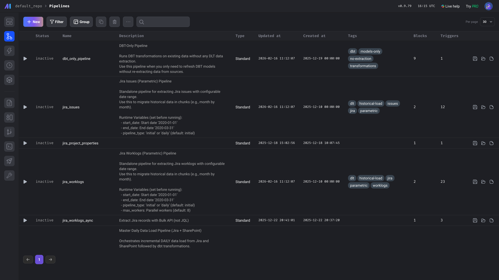
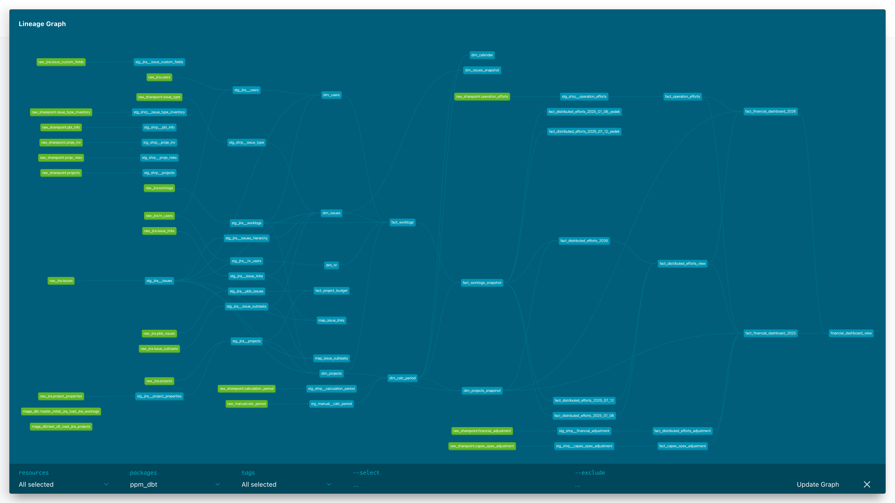
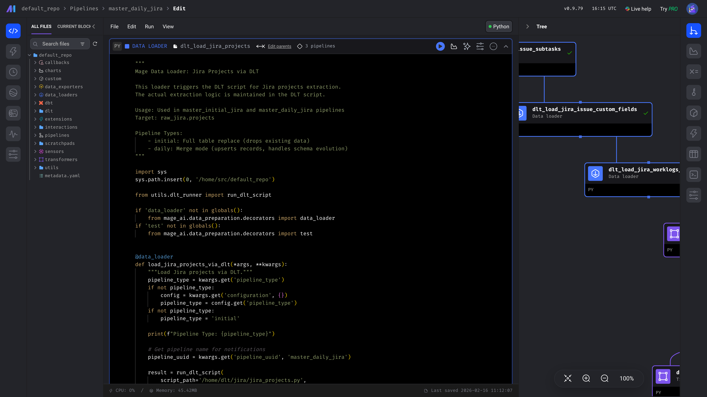
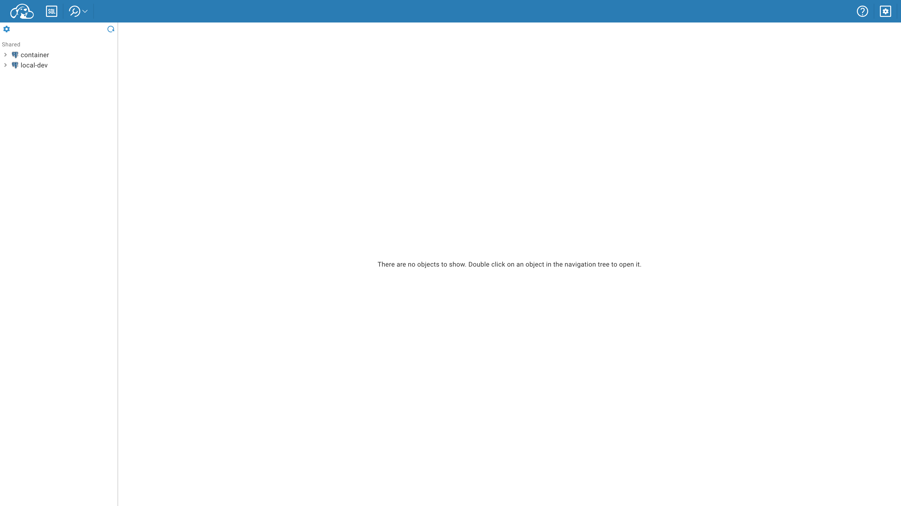

# PPM Data Stack

> **Jira verisi üzerine kurulu açık kaynaklı Proje & Portföy Yönetimi (PPM) analitik platformu.**  
> Kendi sunucunda çalışır · Ücretsiz · Genişletilebilir · Dakikalar içinde production'a hazır.

[](https://www.docker.com/)
[](https://www.getdbt.com/)
[](https://www.postgresql.org/)
[](https://www.metabase.com/)
[](LICENSE)

---

## Neden Bu Proje Var?

Planview, Clarity, ServiceNow PPM gibi kurumsal PPM araçları **yılda $50,000–$500,000** lisans ücreti alır ve verilerinizi tescilli şemalara kilitler. Jira Advanced Roadmaps panolar sunar; veri ambarı değil.

**PPM Data Stack** sana şunları verir:
- Mevcut Jira verilerin üzerinde **tam analitik ambar**
- Her proje, issue, iş günlüğü ve sprint'e **SQL erişimi** — sonsuza kadar
- SharePoint listeleri, Excel yüklemeleri ve İK verileriyle **genişletilebilir pipeline'lar**
- Organizasyondaki her rol için **birleşik portal** — analist, geliştirici, yönetici

Lisans yok. Vendor lock-in yok. Verin senin, altyapın senin.

---

## Mimari

```
┌─────────────────────────────────────────────────────────────────┐
│                        Veri Kaynakları                          │
│   Jira Cloud API  ·  SharePoint Listeleri  ·  Excel/CSV Yükleme │
└──────────┬──────────────────┬───────────────────┬──────────────┘
           │ dlt (Python)     │ dlt               │ Upload API
           ▼                  ▼                   ▼
┌─────────────────────────────────────────────────────────────────┐
│               PostgreSQL  (ham şemalar)                         │
│   raw_jira  ·  raw_sharepoint  ·  uploads  ·  raw_manual        │
└──────────────────────────┬──────────────────────────────────────┘
                           │ dbt (SQL dönüşümleri)
          ┌────────────────┼─────────────────┐
          ▼                ▼                 ▼
       staging           core              mart
    (temiz görünümler)  (dim + fact)   (iş KPI'ları)
                           │
          ┌────────────────┼─────────────────┐
          ▼                ▼                 ▼
      Metabase          Portal            AI Ajan
   (BI / grafikler)  (birleşik UI)  (doğal dil sorgu)
```

**Orkestrasyon:** Mage AI, tüm pipeline'ları ve dbt çalıştırmalarını cron'la zamanlar.

---

## Servisler

| Servis | Port | Amaç |
|--------|------|------|
| **Portal** | 9000 | Rol tabanlı birleşik arayüz — tüm kullanıcılar için giriş noktası |
| **Metabase** | 3000 | Dashboard ve self-servis analitik |
| **Mage AI** | 6789 | Pipeline orkestrasyonu ve zamanlama |
| **dbt Docs** | 8081 | Veri sözlüğü ve data lineage gezgini |
| **CloudBeaver** | 8978 | İleri kullanıcılar için SQL tarayıcısı |
| **Upload API** | 8085 | Excel/CSV yükleme (versiyon geçmişiyle) |
| **AI Ajan** | 7860 | PPM verisi üzerinde doğal dil sorguları |
| **PostgreSQL** | 15432 | Merkezi veri ambarı |

---

## Hızlı Başlangıç

```bash
# 1. Klonla
git clone https://github.com/fxerkan/jira-ppm-data-stack.git
cd jira-ppm-data-stack

# 2. Yapılandır
cp .env.example .env
# .env'yi düzenle — Jira subdomain, email ve API token'ını gir

# 3. Her şeyi başlat
docker compose up -d

# 4. Veri yükle
docker exec ppm-dlt python /app/jira/jira_projects.py
docker exec ppm-dlt python /app/jira/jira_issues.py
docker exec ppm-dlt python /app/jira/jira_worklogs_optimized.py

# 5. Dönüştür
dbt run --project-dir dbt --profiles-dir dbt --target local

# Portala aç
open http://localhost:9000
```

**Demo hesaplar** (şifreleri `.env`'de değiştir):

| Kullanıcı | Şifre | Rol |
|-----------|-------|-----|
| `admin` | `admin123` | Tam erişim — tüm araçlar |
| `developer` | `dev123` | Geliştirici araçları (Mage, CloudBeaver, dbt Docs) |
| `analyst` | `analyst123` | İleri kullanıcı (Metabase, Data Files, AI Ajan) |
| `user` | `user123` | Sadece okuma (Metabase dashboardları) |

---

## PPM Özellikleri

### Mevcut Özellikler

**Portföy Genel Bakış**
- Duruma, türe ve takıma göre toplam proje sayısı
- Önceliğe göre açık issue sayısı
- Projeye ve döneme göre iş günlüğü saatleri
- Portföy sağlık skorları

**Zaman & Efor Takibi**
- Tarihsel anlık görüntülerle worklog fact tablosu (`fact_worklogs`)
- Dönemlere göre dağıtılmış efor hesaplamaları (`fact_distributed_efforts_*`)
- Worklog başına CAPEX/OPEX sınıflandırması (`fact_capex_opex_adjustment`)
- Eksik efor raporları (`rpt_missing_effort`)

**Proje Boyutları**
- Kategoriler, liderler ve özel alanlarla proje ana verisi (`dim_projects`)
- Jira'dan senkronize edilen kullanıcı dizini (`dim_users`)
- Manuel yüklemeyle İK kullanıcı zenginleştirmesi (`dim_hr`)
- Issue hiyerarşisi: Epic → Story → Alt görev (`map_issue_subtasks`)

**Veri Alımı**
- Artan Jira senkronizasyonu (issues, projeler, kullanıcılar, worklog'lar)
- SharePoint liste alımı (riskler, bütçeler, hesaplama dönemleri)
- Versiyon geçmişiyle Excel/CSV yükleme
- Mage AI ile zamanlama ve retry yönetimi

---

## Yol Haritası — Neler Eklenebilir

Ambar şeması genişletilmek için tasarlandı. Her madde yeni bir dlt kaynağı veya dbt modeline karşılık gelir:

### 🔵 Kısa Vadeli (veriler Jira'da zaten mevcut)

| Özellik | Nasıl yapılır |
|---------|--------------|
| **Sprint hızı ve burndown** | `jira_sprints.py` dlt kaynağı → `fact_sprint_velocity` dbt modeli |
| **Cycle time ve lead time** | `fact_issues`'u durum geçiş zaman damgalarıyla genişlet |
| **Takım kapasite vs. kullanım** | `dim_hr` (sözleşmeli saatler) ile `fact_worklogs`'u birleştir |
| **Proje arası bağımlılık haritası** | `jira_issue_links_optimized.py` zaten yüklüyor → Metabase grafiği ekle |
| **SLA / son tarihe uyum** | `fact_issues`'a `due_date` alanı ekle, ihlal % hesapla |
| **Issue yaşlandırma raporu** | `stg_jira__issues`'da açık-kalma günleri hesaplanan alan |

### 🟡 Orta Vadeli (yeni veri kaynağı gerektirir)

| Özellik | Nasıl yapılır |
|---------|--------------|
| **Bütçe vs. gerçekleşen** | Bütçe Excel yüklemesi → `fact_distributed_efforts_*` ile birleştir |
| **Kaynak talep tahmini** | Planlı tahsisatları yükle → kaydedilen saatlerle karşılaştır |
| **Risk kayıt defteri dashboard** | SharePoint risk listesi zaten alınıyor → Metabase dashboard oluştur |
| **OKR / Hedef takibi** | Yeni yükleme şablonu → `fact_okr_progress` dbt modeli |
| **Program Increment planlaması** | Jira Align API veya Excel yükleme via PI board verisi |
| **Portföy finansal özeti** | Departmana, çeyreğe ve proje türüne göre CAPEX/OPEX |

### 🟢 Uzun Vadeli (ML / AI katmanı)

| Özellik | Nasıl yapılır |
|---------|--------------|
| **Tahmine dayalı teslimat tarihi** | Tarihsel hız verisiyle eğit → AI ajanı üzerinden sun |
| **Worklog'da anomali tespiti** | Olağandışı yüksek/düşük efor haftalarını otomatik işaretle |
| **Doğal dil KPI sorguları** | AI ajan bağlı — prompt kütüphanesini genişlet |
| **Yönetici PDF raporları** | Zamanlanan Metabase dışa aktarımı → SMTP ile e-posta |
| **Slack / Teams bildirimleri** | Mage pipeline'larına webhook adımı ekle |

---

## Kurumsal PPM Araçlarıyla Karşılaştırma

| Kapasite | PPM Data Stack | Planview / Clarity | Jira Advanced Roadmaps | MS Project Online |
|----------|:---:|:---:|:---:|:---:|
| Kendi sunucunda çalışır | ✅ | ❌ | ❌ | ❌ |
| Açık kaynak | ✅ | ❌ | ❌ | ❌ |
| SQL veri erişimi | ✅ | ❌ | ❌ | sınırlı |
| Özel dbt modelleri | ✅ | ❌ | ❌ | ❌ |
| Excel/CSV alımı | ✅ | ✅ | ❌ | ✅ |
| AI doğal dil | ✅ | ❌ | ❌ | ❌ |
| Rol tabanlı portal | ✅ | ✅ | sınırlı | ✅ |
| Yıllık maliyet | **$0** | $50k–$500k | ~$15/kullanıcı/ay | ~$10/kullanıcı/ay |

---

## Veri Modeli

```
raw_jira.*          ←  Jira Cloud API'sinden dlt ile alım
raw_sharepoint.*    ←  SharePoint listelerinden dlt ile alım
uploads.*           ←  Upload API üzerinden Excel/CSV
raw_manual.*        ←  yükleme → dbt köprüsü için mapping görünümleri

staging.*           ←  temizlenmiş görünümler (stg_jira__*, stg_shrp__*, stg_manual__*)
core.*              ←  dim_projects, dim_users, dim_hr,
                        fact_worklogs, fact_issues, map_issue_subtasks
mart.*              ←  mart_portfolio_dashboard, agg_project_health,
                        fact_financial_dashboard, rpt_missing_effort
```

---

## Teknik Stack

| Katman | Teknoloji | Sürüm |
|--------|----------|-------|
| Alım | [dlt](https://dlthub.com) | 0.5.x |
| Orkestrasyon | [Mage AI](https://www.mage.ai) | 0.9.x |
| Dönüşüm | [dbt-core](https://www.getdbt.com) + dbt-postgres | 1.x |
| Ambar | PostgreSQL | 16 |
| BI | [Metabase](https://www.metabase.com) | latest |
| SQL Tarayıcı | [CloudBeaver](https://cloudbeaver.io) Community | 24.2 |
| Portal | FastAPI + Jinja2 + Tailwind CSS | Python 3.11 |
| AI Ajan | Gradio + LLM | Python 3.11 |
| Upload API | FastAPI + openpyxl | Python 3.11 |

---

## Ekran Görüntüleri

| Mage AI Pipeline'ları | dbt Lineage |
|---|---|
|  |  |

| Pipeline Detayı | CloudBeaver |
|---|---|
|  |  |

---

## Katkı Sağlama

Pull request'ler memnuniyetle karşılanır. Yeni bir PPM özelliği eklemek için:

1. `dlt/jira/` veya `dlt/manual/` dizinine dlt kaynağı ekle
2. `dbt/models/` dizinine staging + mart dbt modelleri ekle
3. Metabase sorusu veya dashboard'u ekle
4. Yeni modeli `dbt/models/*.yml` dosyasında belgele

---

## Lisans

MIT — özgürce kullan, özgürce değiştir, yapabilirsen geri katkıda bulun.

---

*Kurumsal PPM fiyatları ödemeden kurumsal PPM analitiği isteyen takımlar için.*
